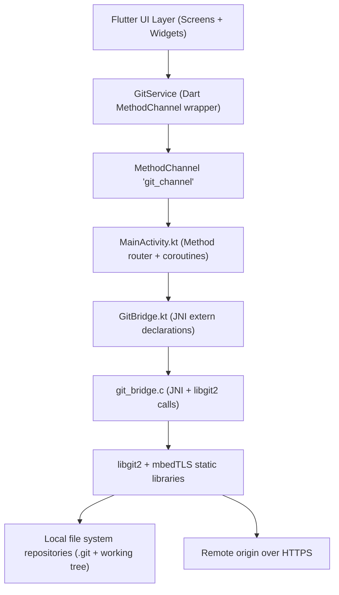
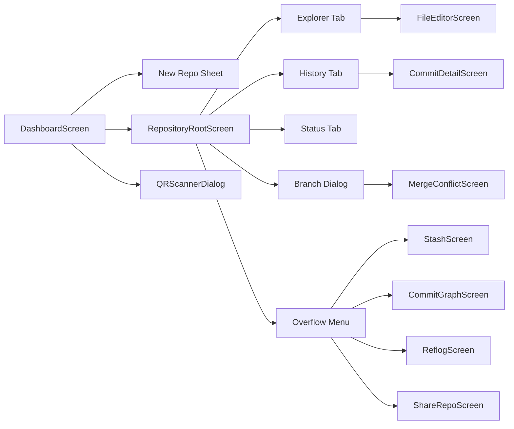
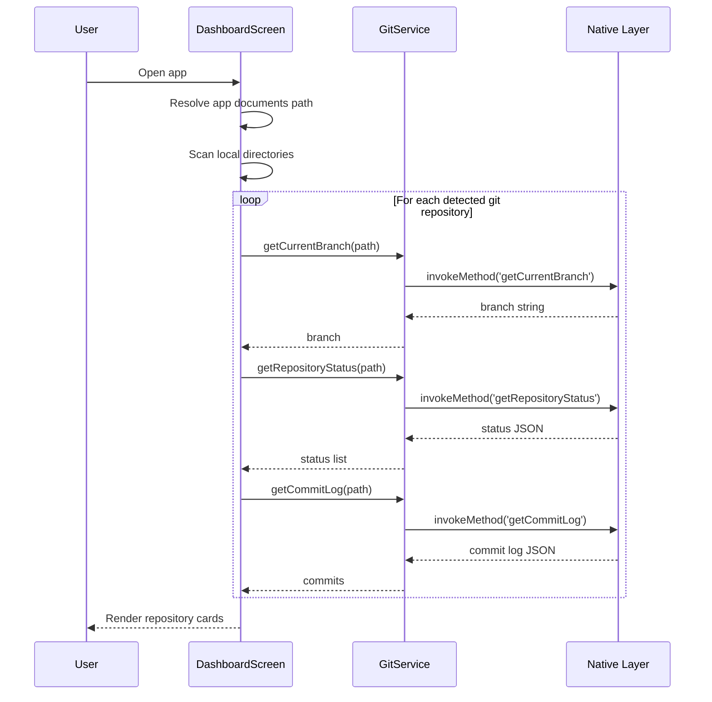
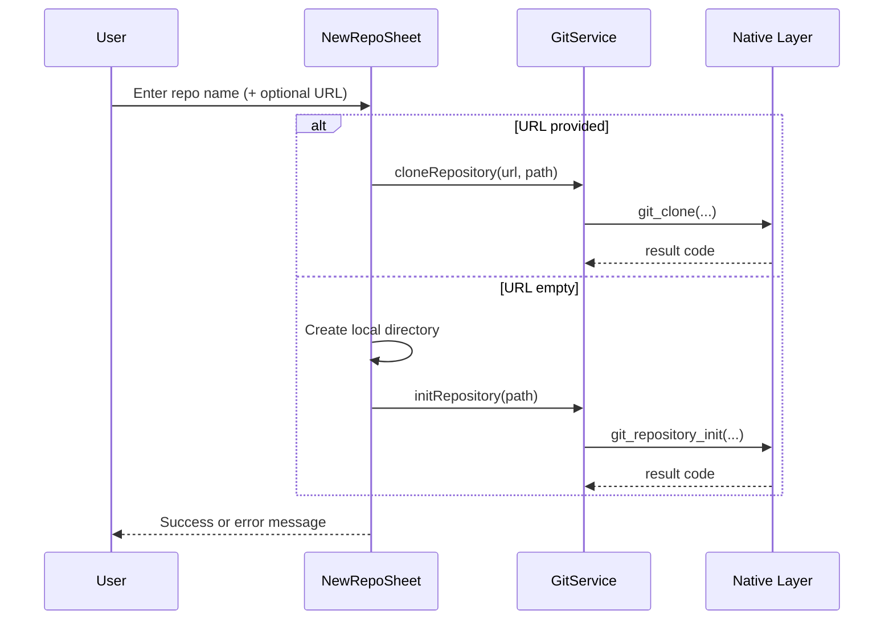
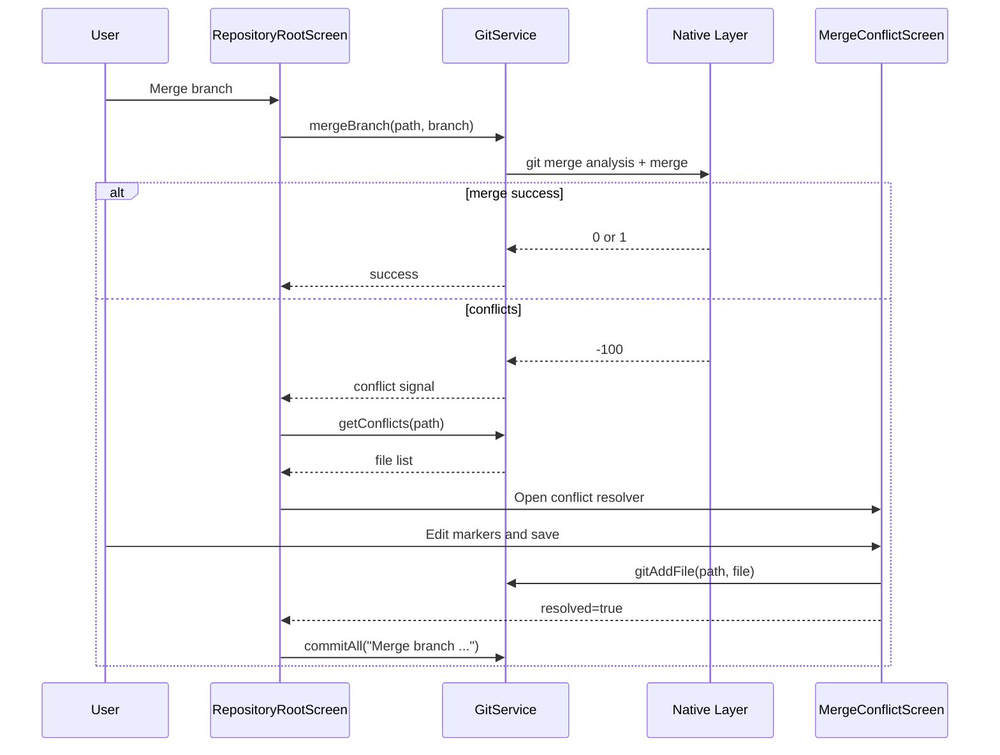
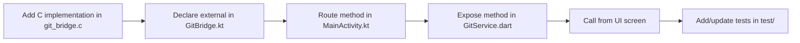

# GitLane Project Deep Dive

This document explains GitLane in a beginner-friendly way first, then adds intermediate-level technical depth.  
Goal: help you understand how the app is built, how data moves, and where to extend it safely.

---

## 1. What GitLane Is

GitLane is a Flutter mobile app that acts like a Git client:

- It lets you create or clone repositories on-device.
- It shows commit history and working tree status.
- It supports branching, merging, stashing, reflog viewing, and basic remote sync.
- It uses a native Android bridge (Kotlin + C + libgit2) for Git operations instead of shelling out to git CLI.

### Beginner mental model

Think of GitLane as 3 layers:

1. UI layer (Flutter screens): what users tap.
2. Service bridge layer (Dart + Kotlin): passes commands safely.
3. Native Git engine (C + libgit2): does the real Git work.

---

## 2. High-Level Architecture



### Why this architecture matters

- Flutter keeps UI fast and cross-platform friendly.
- Native libgit2 gives direct Git features without depending on device shell tools.
- MethodChannel keeps a clear API contract between UI and native layers.

---

## 3. Repository Structure (Important Files)

```text
gitlane/
  lib/
    main.dart
    services/git_service.dart
    ui/
      screens/
        home/dashboard_screen.dart
        home/qr_scanner_dialog.dart
        repository/repository_root_screen.dart
        repository/file_editor_screen.dart
        repository/merge_conflict_screen.dart
        repository/visual_merge_editor.dart
        repository/stash_screen.dart
        repository/share_repo_screen.dart
        repository/reflog_screen.dart
        repository/native_terminal_screen.dart
        commit/commit_detail_screen.dart
        commit/commit_graph_screen.dart
        merge/merge_resolution_screen.dart
      theme/app_theme.dart
      theme/responsive.dart
      widgets/glass_card.dart
      widgets/empty_state.dart
  android/
    app/src/main/kotlin/com/example/gitlane/MainActivity.kt
    app/src/main/kotlin/com/example/gitlane/GitBridge.kt
    app/src/main/cpp/git_bridge.c
    app/src/main/cpp/CMakeLists.txt
    app/src/main/jniLibs/<ABI>/*.a
  test/
    git_service_test.dart
    dashboard_ui_test.dart
    widget_test.dart
```

---

## 4. Runtime Screen Flow



---

## 5. Layer-by-Layer Explanation

## 5.1 Flutter entrypoint

- `lib/main.dart` starts `GitLaneApp`.
- App theme: `AppTheme.darkTheme`.
- Home screen: `DashboardScreen`.

## 5.2 GitService (Dart bridge client)

`lib/services/git_service.dart` wraps all channel calls in static methods.

Patterns used:

- Every method calls `MethodChannel('git_channel').invokeMethod(...)`.
- On `PlatformException`, methods return fallback values (`-1`, `[]`, `null`, `"{}"` style defaults).
- Some methods parse JSON manually (`getBranches`, `getConflicts`) instead of `jsonDecode`.

## 5.3 Method routing (Android Kotlin)

`MainActivity.kt`:

- Registers a MethodChannel handler.
- Routes each method name via `when (call.method)`.
- Executes heavy work on `Dispatchers.IO`.
- Returns to main thread for `result.success(...)` / `result.error(...)`.

Return behavior:

- `Int >= 0` is treated as success.
- `mergeBranch == -100` is also treated as a valid result (conflict signal).
- Other negative ints become `result.error("GIT_ERROR", ...)`.

## 5.4 Native bridge declarations

`GitBridge.kt`:

- Pure JNI declarations (`external fun ...`).
- Loads native shared library `git_bridge`.

## 5.5 Native Git implementation

`android/app/src/main/cpp/git_bridge.c`:

- Implements JNI functions.
- Calls libgit2 APIs directly.
- Handles clone, status, commit, branch, merge, stash, reflog, pull/push, conflicts, etc.

Build pipeline:

- `CMakeLists.txt` links against static libraries:
  - `libgit2.a`
  - `libmbedtls.a`, `libmbedx509.a`, `libmbedcrypto.a`
- ABI filter is limited to `arm64-v8a` and `x86_64`.

---

## 6. Core Feature Flows

## 6.1 App startup and repository discovery

When Dashboard loads:

1. Gets app documents directory.
2. Scans subfolders.
3. Checks for `.git` folder in each subfolder.
4. For each git repo, calls:
   - `getCurrentBranch`
   - `getRepositoryStatus`
   - `getCommitLog`
5. Builds cards showing branch, dirty state, and last commit summary.



## 6.2 Create/clone repository

From Dashboard bottom sheet:

- If URL empty: creates folder + `initRepository`.
- If URL present: runs `cloneRepository(url, path)`.



## 6.3 Status and commit workflow

Inside `RepositoryRootScreen` Status tab:

- Unstaged files can be staged (`gitAddFile`).
- Commit button runs `commitAll`.
- Unstage/discard UI exists but native implementation is currently placeholder in Dart.

```mermaid
stateDiagram-v2
    [*] --> "Clean Working Tree"
    "Clean Working Tree" --> "Unstaged Changes" : edit/create/upload file
    "Unstaged Changes" --> "Staged Changes" : gitAddFile
    "Staged Changes" --> "Committed" : commitAll(message)
    "Committed" --> "Clean Working Tree" : refresh status
```

## 6.4 Merge and conflict workflow

Merge returns:

- `0`/positive: merge completed.
- `-100`: conflict detected.

Conflict path:

1. App opens `MergeConflictScreen`.
2. User edits conflicted file content manually.
3. App stages resolved file with `gitAddFile`.
4. If all conflicts resolved, app performs merge commit via `commitAll`.



## 6.5 Remote sync (push/pull)

UI asks for a PAT token each session and sends it to native calls.

Important native behavior:

- Push currently uses hardcoded refspec `refs/heads/main:refs/heads/main`.
- Pull fetches from `origin` and only fast-forwards `origin/main` path.
- Remote branch logic is currently simplified for prototype scope.

---

## 7. API Contract Map (Dart <-> Native)

| Domain | Method | Inputs | Output | Notes |
|---|---|---|---|---|
| Repo | `initRepository` | `path` | `int` | Create `.git` |
| Repo | `cloneRepository` | `url`, `path` | `int` | HTTPS clone via libgit2 |
| Repo | `getRepositoryStatus` | `path` | `json string` | file path + status |
| Repo | `getCommitLog` | `path` | `json string` | up to 100 commits |
| Repo | `getCommitDiff` | `path`, `commitHash` | `string` | patch text |
| Repo | `gitAddFile` | `path`, `filePath` | `int` | stage one file |
| Repo | `commitAll` | `path`, `message` | `int` | stage-all + commit |
| Branch | `getBranches` | `path` | `json string` | local branches |
| Branch | `getCurrentBranch` | `path` | `string` | shorthand branch |
| Branch | `createBranch` | `path`, `branchName` | `int` | create local branch |
| Branch | `checkoutBranch` | `path`, `branchName` | `int` | switch branch |
| Branch | `mergeBranch` | `path`, `branchName` | `int` | `-100` means conflicts |
| Branch | `deleteBranch` | `path`, `branchName` | `int` | delete local branch |
| Conflict | `getConflicts` | `path` | `json string` | conflicting file names |
| Conflict | `getConflictChunks` | `path`, `filePath` | `json string` | parsed conflict markers |
| Conflict | `resolveConflict` | `path`, `filePath`, `content` | `int` | writes file + stages |
| Stash | `stashSave` | `path`, `message` | `int` | save stash |
| Stash | `stashPop` | `path`, `index` | `int` | apply and drop |
| Stash | `getStashes` | `path` | `json string` | stash metadata list |
| Remote | `pushRepository` | `path`, `token` | `int` | pushes main refspec |
| Remote | `pullRepository` | `path`, `token` | `int` | fetch + FF path |
| Remote | `getRemoteUrl` | `path` | `string` | origin URL |
| Remote | `getSyncStatus` | `path` | `json string` | ahead/behind |
| History | `getReflog` | `path` | `json string` | HEAD movement log |
| Terminal | `runGitCommand` | `path`, `command` | `string` | currently demo/stubbed |

---

## 8. UI Feature Breakdown

## 8.1 Dashboard (`dashboard_screen.dart`)

Responsibilities:

- Discover repos in app storage.
- Search/filter repo cards.
- Show aggregate stats (total/clean/dirty).
- Open new-repo bottom sheet.
- Navigate into repository root screen.

Notable behavior:

- Quick pull on Dashboard is guidance-only right now; it tells user to open repo for credentialed pull.
- QR scanner dialog opens but scanned value is not currently wired into clone flow.

## 8.2 Repository Root (`repository_root_screen.dart`)

Main workspace with 3 tabs:

1. Explorer
   - Browse folders/files (hides `.git` and dotfiles).
   - Rename/delete files and folders.
   - Create new file.
   - Open editor screen for files.
2. History
   - Commit timeline list.
   - Opens detailed commit diff viewer.
3. Status
   - Staged vs unstaged sections.
   - Swipe actions for stage/unstage/discard.
   - Commit CTA when changes exist.

App bar/overflow actions:

- Branch manager (create, checkout, merge, delete).
- Pull/push with PAT.
- Stash save/list.
- Commit graph.
- Reflog history.
- Share repo via QR.
- Import files from file picker.

## 8.3 Supporting screens

- `commit_detail_screen.dart`: commit header + diff rendering with per-line color coding.
- `commit_graph_screen.dart`: lane-based commit graph painter.
- `merge_conflict_screen.dart`: manual text conflict resolution + stage.
- `stash_screen.dart`: list/pop stashes.
- `share_repo_screen.dart`: QR + copy URL.
- `reflog_screen.dart`: timeline of HEAD actions.
- `file_editor_screen.dart`: syntax-highlight editor + save + commit.

Prototype or partially wired screens:

- `native_terminal_screen.dart` exists, but not linked in current overflow menu.
- `visual_merge_editor.dart` exists, but not linked from current conflict flow.
- `merge_resolution_screen.dart` appears to be a static prototype/demo view.

---

## 9. Native Layer Deep Notes

## 9.1 Threading model

- Kotlin handler runs each native request inside `Dispatchers.IO`.
- Keeps UI thread responsive during Git operations.

## 9.2 Return/error model

- C functions return ints or JSON/strings.
- Kotlin converts negative int results into `result.error(...)` (except merge `-100`).
- Dart catches platform errors and converts to fallback values.

Effect:

- UI rarely crashes on native errors.
- But detailed errors can be hidden behind generic fallback values.

## 9.3 Security and transport notes

- Token handling:
  - PAT is entered via dialog and stored in a Dart field for session lifetime.
  - Not persisted securely to disk (good for short-lived prototype, not enough for production).
- TLS cert callback in native clone/push/pull currently bypasses strict validation logic in callback (`return 0`).
  - This is called out in native comments as a hackathon simplification.

---

## 10. Theming and UX System

`AppTheme` defines a consistent Git-style dark palette:

- Background tiers: `bg0`, `bg1`, `bg2`.
- Semantic colors:
  - green for success/staged
  - yellow for modified
  - red for conflicts/errors
  - cyan for primary actions

Reusable UI primitives:

- `GlassCard`: blurred/glassmorphism card wrapper.
- `EmptyState`: standardized empty/error/no-data view.
- `Responsive`: width breakpoints and max content widths.

---

## 11. Testing Strategy in Current Repo

Current tests:

- `test/git_service_test.dart`
  - mocks MethodChannel and validates method names/arguments.
- `test/dashboard_ui_test.dart`
  - widget-level rendering checks with mock path provider/channel.
- `test/widget_test.dart`
  - basic smoke render test.

Coverage profile:

- Good for smoke and contract sanity.
- Limited for real native behavior (since native side is mocked in tests).
- No instrumentation/E2E coverage yet for JNI/libgit2 edge cases.

---

## 12. Known Gaps and Intermediate-Level Risks

These are important if you plan to harden this project:

1. Commit log contract mismatch:
   - Native `getCommitLog` currently emits `date` string.
   - Some UI code expects numeric `time` field for relative time.
2. Branch parsing in Dart:
   - `getBranches()` and `getConflicts()` use string replace/split instead of robust JSON decode.
3. Remote sync assumptions:
   - Push and pull paths are mostly tied to `main`/`origin/main`.
4. Status actions:
   - Unstage/discard UI exists but backend calls are placeholders in Dart.
5. TLS handling:
   - Certificate callback currently bypasses stricter validation path.
6. Some features are present but not wired:
   - Native terminal, visual merge editor, sync status.

---

## 13. How to Extend GitLane Safely

If you add a new Git feature, follow this order:

1. Add JNI C function in `git_bridge.c`.
2. Add `external fun` declaration in `GitBridge.kt`.
3. Route it in `MainActivity.kt` `when (call.method)`.
4. Add wrapper method in `GitService`.
5. Use it from Flutter screen with clear success/error UI.
6. Add MethodChannel unit tests for method contract.



---

## 14. Quick Glossary (Beginner-Friendly)

- Repository: a folder tracked by Git (`.git` exists inside).
- Working tree: your actual files on disk.
- Staging: choosing which changed files go into next commit.
- Commit: a saved snapshot in Git history.
- Branch: a movable pointer to a line of commits.
- Merge: combining changes from one branch into another.
- Conflict: Git cannot auto-merge some lines; user must resolve.
- Reflog: safety history of where HEAD pointed over time.
- HEAD: pointer to your current commit/branch context.

---

## 15. One-Paragraph Summary

GitLane is a Flutter-first mobile Git client with a native Android Git core. The UI is modern and feature-rich for local workflows, while Git operations run through a clean MethodChannel + JNI bridge into libgit2. Architecturally, it is strong for a hackathon/prototype and already includes real repository actions (commit/branch/merge/stash/remote). The next maturity step is hardening data contracts, security choices, and wiring currently partial features into the primary workflow.

